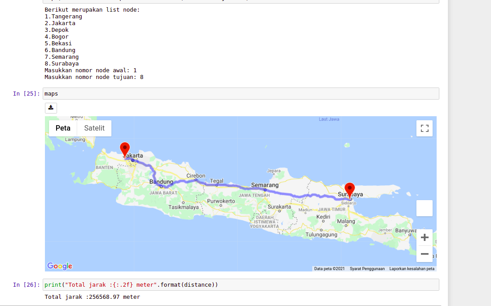
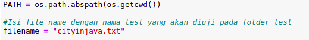

## General info
Tugas tugas apa yang kecil... tugas kecil hohohihe
Tugas kecil ini merupakan tugas implementasi algoritma A* untuk menentukan lintasan terpendek.

## Screenshots

## Technologies
* Jupyter Notebook

## Setup Jupyter Notebook
* pada terminal Install jupyter notebook
`pip install notebook`
* pada terminal Install  widget 
`jupyter nbextension enable --py --sys-prefix widgetsnbextension`
 apabila terdapat error dapat dilakukan:
 `jupyter nbextension enable --py widgetsnbextension`
* pada terminal gmaps extension
`pip install gmaps`
 apabila terdapat error dapat dilakukan:
 `jupyter nbextension enable --py widgetsnbextension`
* aktifkan ekstensi gmaps
`jupyter nbextension enable --py --sys-prefix gmaps`
 apabila terdapat error dapat dilakukan:
 `jupyter nbextension enable --py widgetsnbextension`

## Mennjalankan program
*Jalankan semua cell:
*edit nama test file sesuai nama test yang akan diuji.

* masukkan angka node awal dan node akhir saat menjalankan cell
* jalankan cell maps dan jarak. 

## Features

* Menampilkan maps dengan GMAPS API

## Status
Finished AJG (asik juga)

## Inspiration
https://jupyter-gmaps.readthedocs.io/en/latest/install.html

## Pembuat
Created by 13518021 Zaidan Naufal Sudrajat  & 13519101 Stefanus 